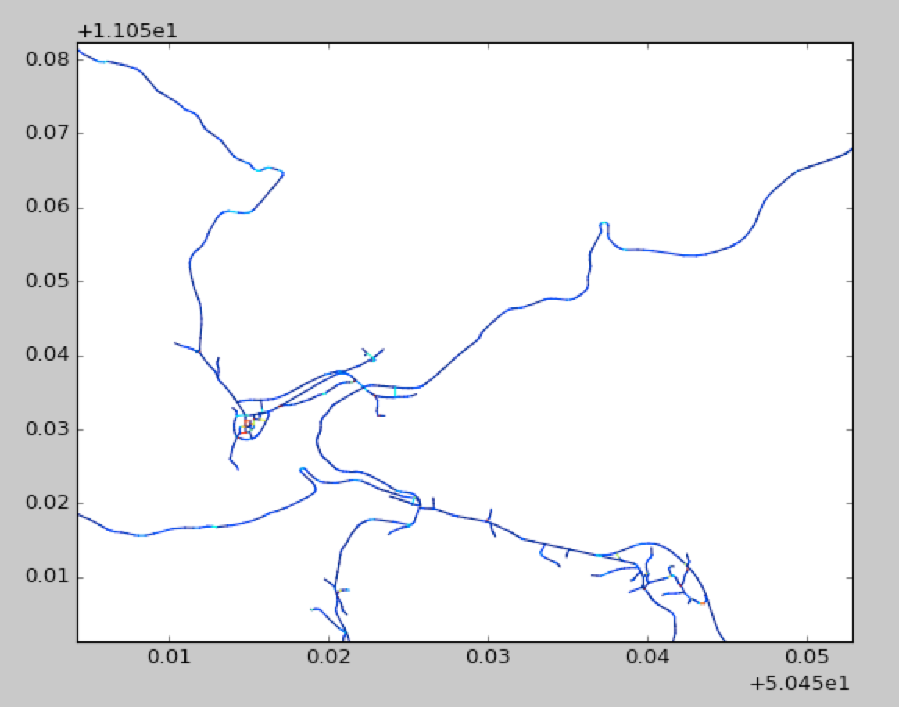

# motofun 
Finds routes with maximum fun factor for motorcycle drivers. The algorithm uses Open Street Maps database to query roads. The algorithm classifies road segments into "fun" classes, depending on their curvature, length, speed limit etc.

